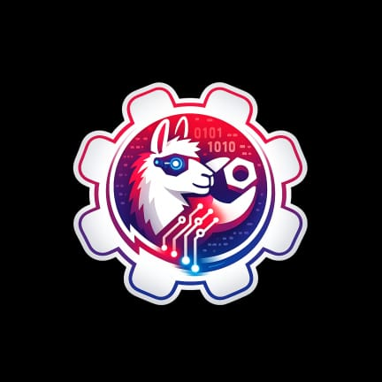

  

# 🤖 My AI

**My AI** é um aplicativo que executa modelos de linguagem **LLaMA no formato GGUF localmente**, diretamente no dispositivo, sem dependência de internet ou APIs externas.

O projeto tem como objetivo oferecer uma solução de **Inteligência Artificial offline**, com **privacidade**, **autonomia** e **controle total do usuário** sobre os modelos e dados utilizados.

---

## 🚀 Sobre o Projeto

Este aplicativo foi desenvolvido por **um integrante da equipe Clusters**, equipe de **FIRST Tech Challenge (FTC)** do **Instituto SESI SENAI**.

O **My AI** possui relação direta com a FTC, tendo sido idealizado para atuar como um **assistente de apoio à equipe**, podendo ser utilizado para:

- Auxiliar programadores durante o desenvolvimento de código  
- Apoiar o estudo de conceitos técnicos e lógicos  
- Contribuir com a organização da equipe  
- Ajudar no planejamento de tarefas, cronogramas e divisão de atividades  

Trata-se de um projeto com caráter **educacional, experimental e de apoio ao desenvolvimento técnico**, alinhado aos valores da FTC, como inovação, aprendizado prático e trabalho em equipe.

---

## 🧠 Funcionalidades

- Execução local de modelos **LLaMA (GGUF)**
- Funcionamento **100% offline**
- Suporte a modelos personalizados
- Nenhuma dependência de serviços externos
- Foco em privacidade, desempenho e controle do usuário

---

## 🔒 Privacidade e Segurança

O **My AI** não coleta, armazena ou transmite dados para servidores externos.  
Toda a inferência e processamento ocorrem **exclusivamente no dispositivo**, garantindo segurança e confidencialidade das informações.

---

## 🛠️ Tecnologias Utilizadas

- Modelos **LLaMA (GGUF)**
- Inferência local (ex: `llama.cpp` ou implementação equivalente)
- Android / Kotlin *(quando aplicável)*
- Arquitetura modular voltada para experimentação e aprendizado

---

## 📚 Objetivo Educacional

Os principais objetivos deste projeto incluem:

- Aplicar conceitos de Inteligência Artificial na prática  
- Explorar o uso de LLMs em ambiente local  
- Desenvolver habilidades em engenharia de software  
- Apoiar equipes de robótica na organização e programação  
- Incentivar o uso ético, consciente e privado da IA  

---

## 📄 Licença

Este projeto é distribuído sob uma licença open-source.  
Para mais informações, consulte o arquivo `LICENSE`.

---

## 🤝 Contribuições

Contribuições são bem-vindas, desde que alinhadas ao propósito educacional e técnico do projeto.

---

> Projeto desenvolvido por um integrante da **equipe Clusters – FIRST Tech Challenge (FTC)** > **Instituto SESI SENAI**
